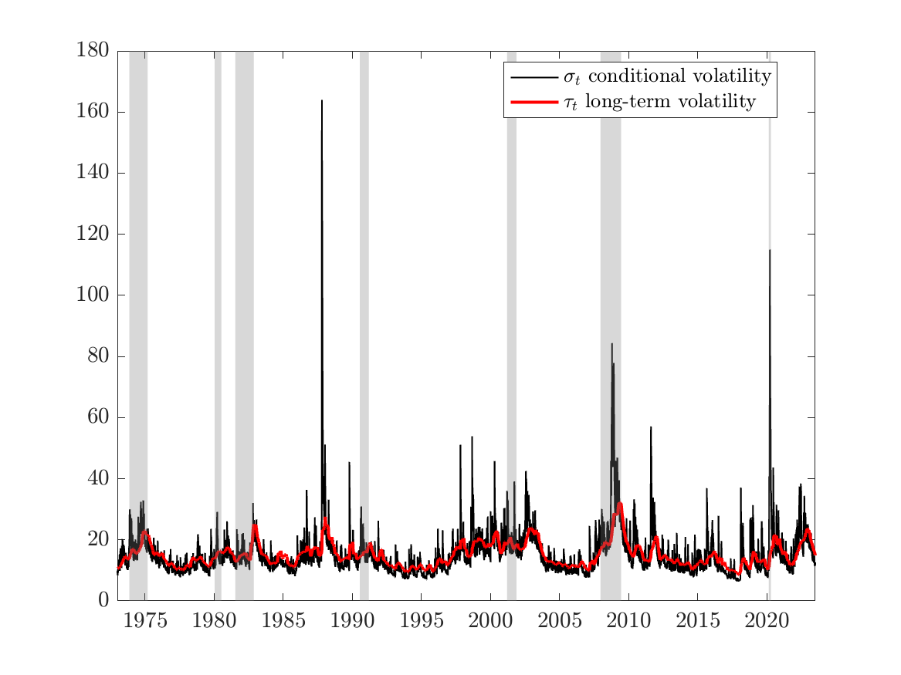
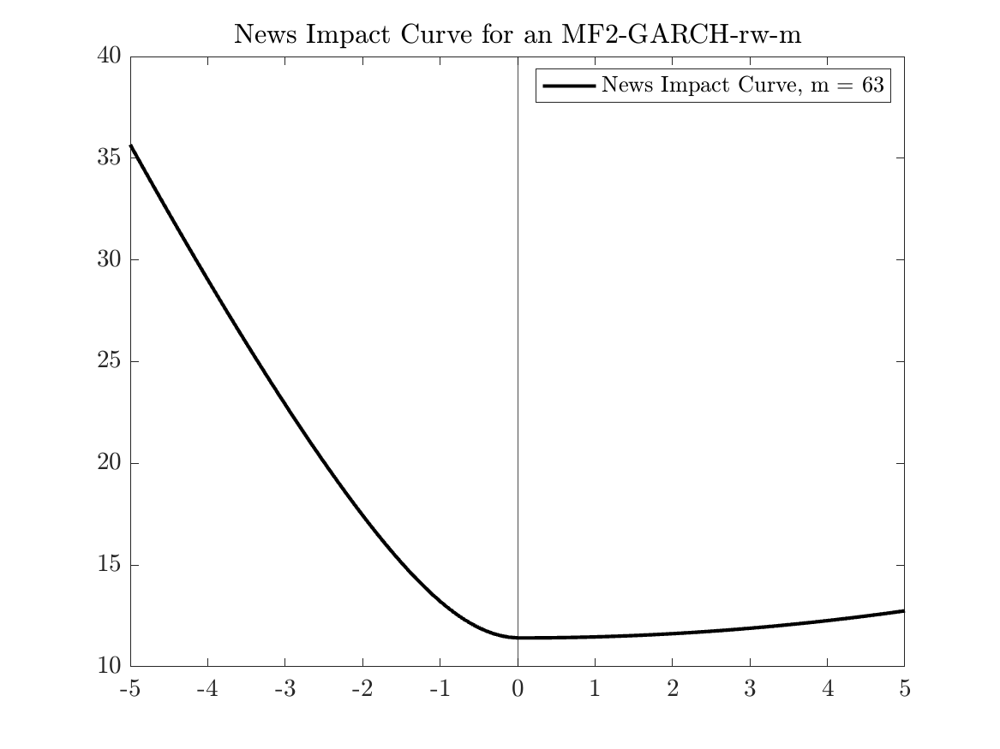
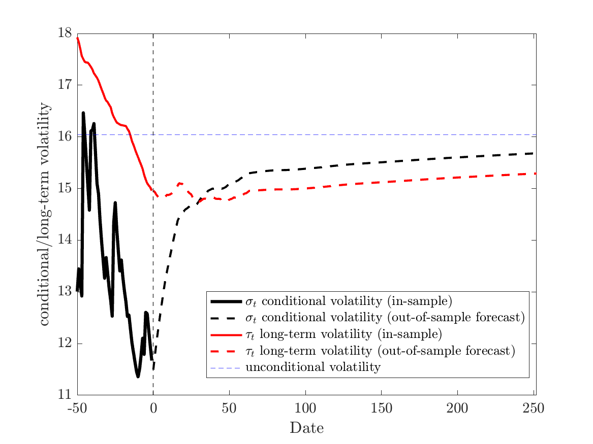
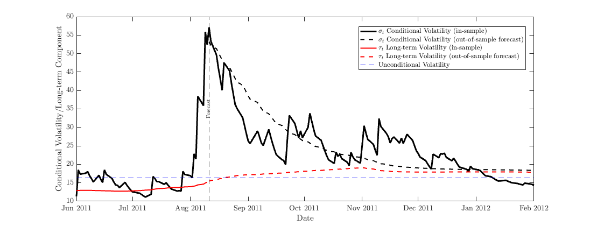

# MF2-GARCH Toolbox for Matlab (developed by Christian Conrad and Julius Schoelkopf, 2025)

A Matlab package for estimating and forecasting volatility using the multiplicative factor multi-frequency GARCH (MF2-GARCH) proposed in ["Modelling Volatility Cycles: The MF2-GARCH Model" by Conrad & Engle (2025)](http://dx.doi.org/10.2139/ssrn.3793571). The MF2-GARCH is used in ["Long-term volatility shapes the stock markets sensitivity to news“ by Conrad, Schoelkopf, and Tushteva (2024)](http://dx.doi.org/10.2139/ssrn.4632733): 

* A comprehensive toolbox for estimating and forecasting volatility using the MF2-GARCH-rw-m.
* Code for five applications: estimation, news impact curve, out-of-sample forecasting, illustration of forecasting behavior 

## Suggested Citation
Please cite as: 
> Conrad, Christian and Engle, Robert F., Modelling Volatility Cycles: The MF2-GARCH Model (2005). Journal of Applied Econometrics.
 
and

> Conrad, Christian and Schoelkopf, Julius Theodor and Tushteva, Nikoleta, Long-Term Volatility Shapes the Stock Market's Sensitivity to News (2024). Available at SSRN:  http://dx.doi.org/10.2139/ssrn.4632733

and 

> Conrad, Christian and Julius Schoelkopf. 2025. MF2-GARCH Toolbox for Matlab. Matlab package version 0.1.0. 

## Contact 
Please address any questions about the Matlab code to:
* Christian Conrad,  Heidelberg University, Department of Economics. Email: christian.conrad [at] awi.uni-heidelberg.de 
* Julius Schoelkopf, Heidelberg University, Department of Economics. Email: julius.schoelkopf [at] awi.uni-heidelberg.de 

We do not assume any responsibilities for results produced with the available code. Please let us know, if you have suggestions for further versions or find any bugs. 

# Applications 

## Estimation of the MF2-GARCH-rw-m model in Matlab for S&P 500 stock returns 
Define daily log-returns as $y_t=\sigma_t Z_t=$ $\sqrt{h_t \tau_t} Z_t$, where the $Z_t$ are i.i.d. with mean zero, variance one, and symmetric density. The fourth moment of the $Z_t$ is denoted by $\kappa$. $\sigma_t^2$ denotes the conditional variance and the short- and long-term volatility components are given by $h_t$ and $\tau_t$. Let `y` be a (Tx1) vector of daily log-returns. The short-term volatility component is defined as a unit variance GJR-GARCH(1,1)
```math
h_t=(1-\phi)+\left(\alpha+\gamma \mathbf{1}_{\left\{y_{t-1}<0\right\}}\right) \frac{y_{t-1}^2}{\tau_{t-1}}+\beta h_{t-1}
```
and the long-term component is specified as a MEM equation for the conditional expectation of $V_t = y_t^2/h_t$  (squared deGARCHed returns):
```math
\tau_t=\lambda_0+\lambda_1 V_{t-1}^{(m)}+\lambda_2 \tau_{t-1}
```
where
```math
V_{t-1}^{(m)}=\frac{1}{m} \sum_{j=1}^m V_{t-j}=\frac{1}{m} \sum_{j=1}^m \frac{y_{t-j}^2}{h_{t-j}}.
```
The MF2-GARCH can be estimated using the following function from our toolbox in Matlab
```matlab
[coeff, qmle_se, p_value_qmle,  Z, h, tau, sigma_annual, tau_annual, annual_unconditional_vola, foptions]  = mf2_garch_estimation(y,foptions); 
```

The function `mf2_garch_estimation(y,foptions)` gives you an estimation output for the seven parameters $\left(\mu, \alpha, \gamma, \beta, \lambda_0, \lambda_1, \lambda_2\right)$ of the short- and long-term component in the command window obtained by maximizing the log likelihood. The output of the function are the vectors for the coefficient estimates (`coeff`), the Bollerslev-Wooldridge robust standard errors  (`qmle_se`), and the corresponding p-values  (`p_value_qmle`). Moreover, the function `mf2_garch_estimation(y,foptions)` provides you with the standardized residuals $Z$, the fitted values for the short (`h`) and long-term component (`tau` or annualized `tau_annual`) as well as the time series for annualized conditional volatility (`sigma_annual`) and the estimate for the annualized unconditional volatility (`annual_unconditional_vola`). 

For the long-term component, you need to specify $m$, i.e. the number days over which $V_t^{(m)}$ is computed. Choose whether you want to use a fixed value of $m$ or let the optimal $m$ be selected as the one that minimizes the BIC. The `foptions` structure contains the researcher's choice for $m$. You either specifiy `foptions.choice = 'BIC'` if the optimal $m$ needs to be selected or `foptions.choice = 'fix'` together with the choice of your $m$ as `foptions.m=63`. When computing the likelihood, we discard the first two years of `y' (i.e., 2*252 trading days) to account for lags of the squared  deGARCHed returns. This allows comparing the BIC of models with different values of m. You could decrease this, but you need to discard at least $2m$ values. The Matlab function uses constraints on the parameters following assumption 2 (for the short-term component) and assumption 3 (for the long-term component) of Conrad & Engle (2025). For details on the estimation, see section [A.1.1 in Conrad & Engle (2025)](http://dx.doi.org/10.2139/ssrn.3793571). 

The following application of the MF-2GARCH replicates the second panel in Table 2 in Conrad & Engle (2025) for the MF2-GARCH-rw-m. In Conrad & Engle (2025), all models were estimates using OxMetrics. We use daily S&P 500 log-return data from January 1971 to June 2023. For the sub-period 1971-1983, the return data was initially obtained from the Federal Reserve Bank of St. Louis database.  Data from 1983 onwards are from TickData. 

```matlab
%% Import the return data to Matlab (S&P500 returns from 1971-2023) 

% Read the data into a table
Returns = readtable('data/SP500_1971_2023_06_30_ret.xlsx');

% Extract the column 'RET_SPX' from the table and store it 
y = Returns.RET_SPX;

%% Select the m for the estimation
foptions.choice = 'fix'; % choices: 'BIC' or 'fix' (specify m) 

% If f.options.choice = 'fix', please specify the m you choose here: 
foptions.m=63;

%  Example A (Estimation) for regresion output: 
mf2_garch_estimation(y,foptions); 
```
This yields the following output in the command window: 
```matlab
===================== Estimation results MF2-GARCH-rw-m =====================

The optimal m was specified by the user: m = 63
Log-Likelihood Function = -16678.611, BIC = 2.524
Estimated fourth moment of the innovations: kappa = 5.441
     Parameter      Coefficient    Standard Error     p-value      Significance
    ____________    ___________    ______________    __________    ____________

    {'mu'      }      0.030395       0.0069646       1.2758e-05       "***"    
    {'alpha'   }     0.0032236       0.0026327          0.22078       ""       
    {'gamma'   }       0.16169        0.020378       2.2204e-15       "***"    
    {'beta'    }       0.83956        0.017385                0       "***"    
    {'lambda_0'}      0.017512       0.0072155         0.015226       "**"     
    {'lambda_1'}       0.11183        0.046429         0.016013       "**"     
    {'lambda_2'}       0.87014        0.051675                0       "***"    

Output reports Bollerslev-Wooldridge robust standard errors (see Conrad and
Engle (2025), equation (27)).
Covariance stationarity condition satisfied (see Conrad and Engle (2025),
equation (7)): Gamma_m = 0.778
Annualized unconditional volatility = 16.043
==============================================================================
```

If you additionally want to store the fitted values, specify the output of the function as follows 
```matlab
[coeff, qmle_se, p_value_qmle,  Z, h, tau, sigma_annual, tau_annual, annual_unconditional_vola, foptions]  = mf2_garch_estimation(y,foptions);
```
You can use this output for instance for a figure of the estimated conditional volatility and long-term volatility over the full-sample. The figure shows the estimated conditional volatility (black line) and long-term volatility (red line) from the MF2-GARCH-rw-63 model for the daily S\&P 500 returns. Grey shaded areas represent NBER recession periods for the US.
```matlab
% Extract the date column (not required for estimation, only for figure) 
dates = datetime(Returns.OBS, 'InputFormat', 'MM/dd/yyyy'); 

% Figure of time series
mf2_garch_time_series(dates, sigma_annual, tau_annual);
```
The function exports the following figure in the figures folder: 



Additionally, you can plot the news impact curve for the estimated model. Following Engle and Ng (1993), we use the NIC to illustrate how the conditional volatility is updated in response to new information. The NIC is presented in term of annualized volatilities (see equation (10) in Conrad & Engle (2025)). The following function provides a figure for the NIC: 
```matlab
[ r, NIC] = mf2_garch_nic(Z, h, tau, foptions, coeff);
```

The function exports the following figure in the figures folder: 



## Forecasting at the end of the sample 

First, you need to specifiy the maximum forecasting horizon using ```foptions.S```, e.g. ```foptions.S = 250``` if you want to forecast the next 250 days. Next, you can use the forecasting function that provides forecasts for the (annualized) conditional volatility, the short- and (annualized) long-term component: 
```matlab
[horizon, forecast, an_vola_forecast, h_forecast, tau_forecast, tau_forecast_annual]  = mf2_garch_forecasting(y, Z, h, tau, coeff, foptions);
```
You must use the same sample as in estimation function for the forecasting function. Moreover, the function displays in the command window the forecasts (from the end of the sample) for the annualized volatility on the next day, next week (5 days), next month (21 days), next 6 months (126 days), and 12 months (252 days) based on the estimated parameters. 
```matlab
annualized volatility forecast 1 day: 53.2229

annualized volatility forecast 1 week (5 days):  49.2739

annualized volatility forecast 1 moth (21 days):  34.4209

annualized volatility forecast 1 day:  46.3527

annualized volatility forecast 1 week (5 days): 43.0904

annualized volatility forecast 1 moth (21 days):  30.8893

annualized volatility forecast 6 moths (126 days):  18.2700
```
We now want to illustrate forecasting out of sample using a figure. The following code yields a figure of the forecasts of the conditional volatility and the long-term component in the last 50 days of the sample and the forecasts for the next S days: 
```matlab
mf2_garch_out_of_sample_figure(sigma_annual, an_vola_forecast, tau_forecast_annual, annual_unconditional_vola, foptions)
```


## Illustration of Forecasting behavior 
Last, we want to illustrate the MF2-GARCH’s out-of-sample forecast performance, as in Figure 5 in Conrad & Engle (2025. We want to forecast volatility from August 10, 2011 (10249 in dates vector) 120 days into the future and use the forecasting function:  

```matlab
% Specifiy the maximum forecasting horizon: 
foptions.S = 120; 

% Estimation of the MF2-GARCH We want to forecast volatility from August 10, 2011 (10249 in dates vector) 150 days into the future. Specify the cutoff from where you want to forecast: 
foptions.cutoff_date = datetime(2011,8,10);  
foptions.cutoff = 10249; 
% Therefore, we need to reestimate the model using data until August 10, 2011. 
[coeff, ~, ~, Z, h, tau, ~, tau_annual, annual_unconditional_vola, foptions]  = mf2_garch_estimation(y(1:foptions.cutoff),foptions); 

% Forecasting exercise: This function provides forecasts for the annualized volatility, h and tau for the next S days from the end of the specified sample. 
[horizon, forecast, an_vola_forecast, h_forecast, tau_forecast, tau_forecast_annual]  = mf2_garch_forecasting(y(1:cutoff), Z, h, tau, coeff, foptions);

% Illustration of forecasting behaviour as in Figure 5 from Conrad & Engle (2025): 
mf2_garch_illustration_forecasting_figure(sigma_annual, an_vola_forecast, tau_forecast_annual, annual_unconditional_vola, foptions, dates)
```
The following figure is saved as 'ForecastIllustration.png' in the figures folder: 



The figure shows the conditional volatility (solid black line) from an MF2-GARCH-rw-m model with $m = 63$ estimated for S&P 500 returns. From August 10, 2011 (indicated by the black vertical line) onwards, we compute volatility forecasts (dashed black line) for 120 days in the future. The plot also shows the long-term component (red line) and the forecast of long-term volatility (dashed red line). All quantities are annualized. The conditional volatility as well as the long-term component are below the unconditional volatility until there is a jump in volatility up to a level above 50%, driven by the European sovereign debt crisis and a downgrade of the U.S.’s credit rating by Standard & Poor’s. In the medium run, the forecast for the conditional volatility converges towards the forecast of the long-term component (dashed red line). In the very long run, the MF2-GARCH forecast will converge towards the unconditional volatility.
